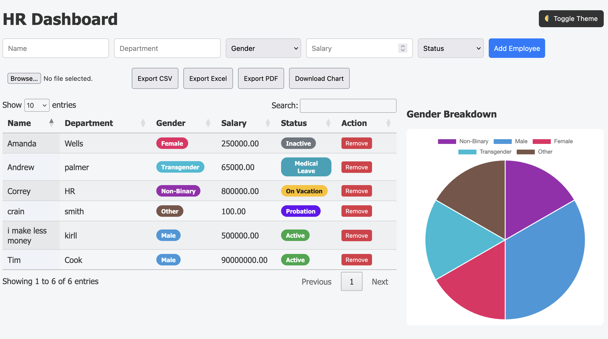

# 💼 HR Dashboard

A fully interactive HR dashboard for managing employee data — with charts, tables, exports, and dark/light mode. Built using **vanilla JS**, **Chart.js**, and **DataTables** with a modern responsive UI.

🔗 **Live Demo**: [https://ceifling98.github.io/HR-Dashboard/](https://ceifling98.github.io/HR-Dashboard/)

---

## 📸 Screenshot

---

## ✨ Features

- ➕ Add, edit, delete employee records
- 📊 Gender breakdown pie chart (auto-updating)
- 🏷️ Colored badges for gender & status
- ☁️ Import from CSV or JSON
- 💾 Export to CSV, Excel, and PDF
- 🌗 Toggle between dark & light mode (auto-saved)
- 📥 Download the chart as PNG
- 📱 Responsive layout for all screen sizes

---

## 🛠 Technologies Used

- HTML5 + CSS3
- JavaScript (ES6+)
- [Chart.js](https://www.chartjs.org/)
- [DataTables](https://datatables.net/)
- [SheetJS](https://sheetjs.com/)
- [jsPDF + autotable](https://github.com/parallax/jsPDF)

---

## 🔖 Status Types

- Active
- Inactive
- On Vacation
- Medical Leave
- Terminated
- Probation

## 🌈 Gender Options

- Male
- Female
- Non-Binary
- Transgender
- Other
- Prefer Not to Say

---

## 🙋‍♂️ About the Developer

**Correy Eifling-Patterson** – Front-end developer, U.S. Army veteran, and IT specialist with a passion for accessible, data-driven interfaces.

- 🌐 [GitHub](https://github.com/ceifling98)
- 🔗 [LinkedIn](https://www.linkedin.com/in/eifling-patterson/)
- 📬 ceifling98@gmail.com

---

> 🎯 "Build with intention. Design for people. Deploy with pride."

